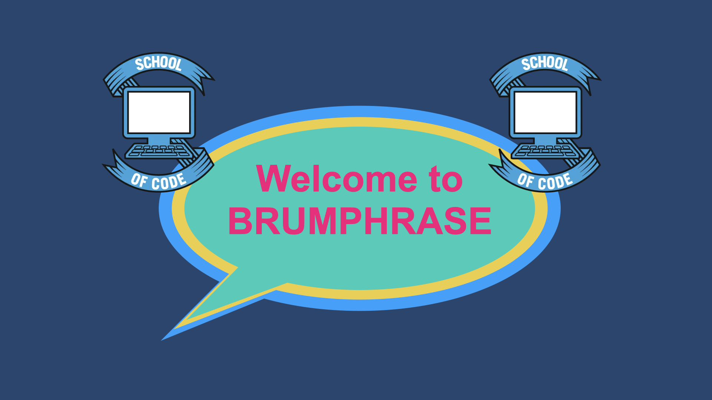

# Brum-Phrase

_23rd October 2020_
_Week 5 at the [School of Code](https://www.schoolofcode.co.uk)_

This was our week 5 Friday hackathon at the [School of Code](https://www.schoolofcode.co.uk) which was Object Oriented Programming Week

Isabel Holland @hey-irh (my paired-programming partner for the week) and I created Brum Phrase - and OOP inspired Catchphrase game

This was a really difficult but fun hackethon

Isabel and I are planning on refactoring and sorting out the stylings with our new found CSS Skills 😀

👾 **Brum Phrase** 🕹️



## Built with

- HTML
- CSS
- JavaScript

## Installation

1. Clone the repository

```
https://github.com/randleem/Brum-Phrase.git
```

2. Navigate to the repo

3. Copy the path of the HTML file and copy into your browser

4. Enjoy

## Usage

1. Launch the App
2. Enter player 1 & 2 names
3. Take it in turns to guess the correct Brum Phrase based on the questions
4. If your answer is correct you will be given the option to guess the Image behind the answer tiles
5. If your guess is wrong, it is now the next player's turn to select the Brum Phrase
6. The winner if the player who correctly guesses the background image
